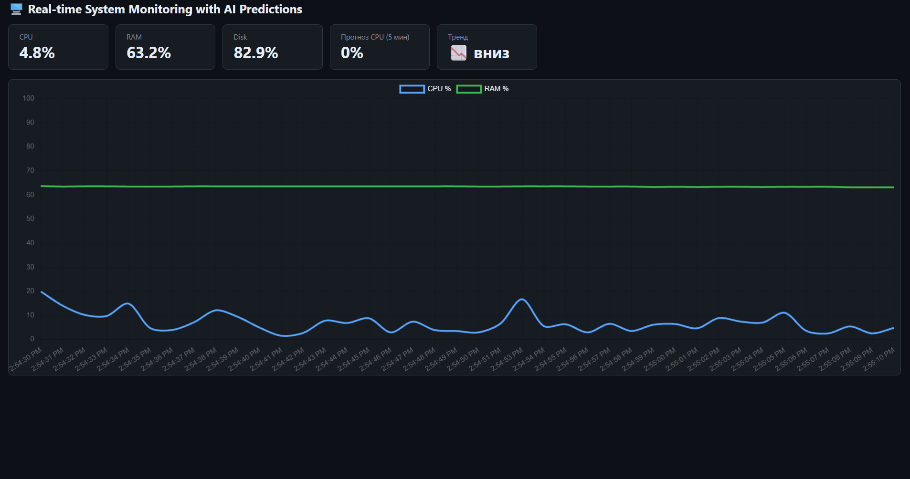
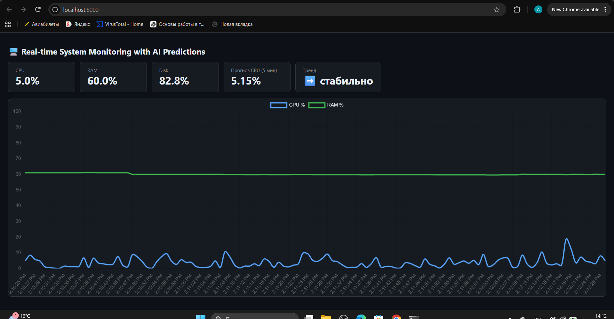
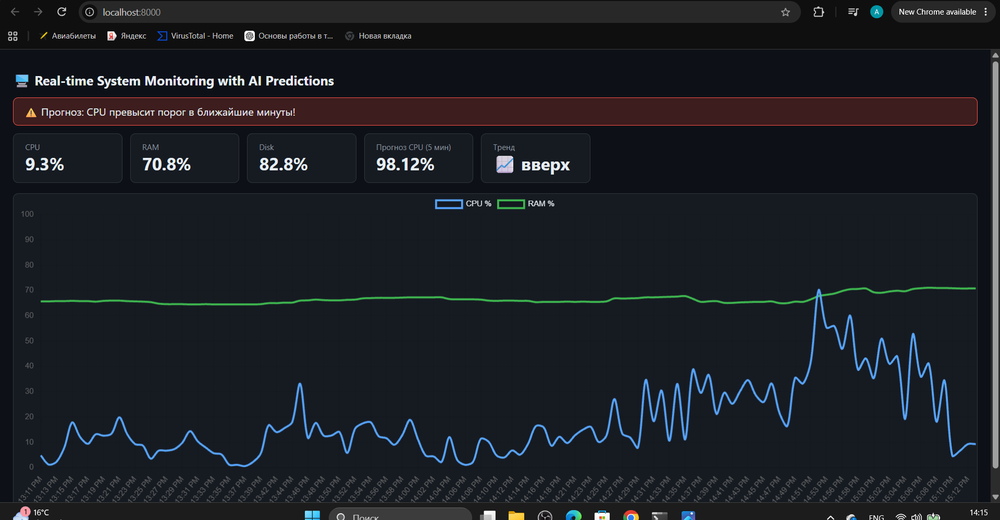

# 🖥️ Real-Time System Monitoring with AI Predictions

A lightweight system-monitoring dashboard that collects CPU, memory, disk, and network metrics in real time, streams them over WebSocket, and forecasts short-term CPU load using a smoothed linear trend.

> Portfolio project focused on monitoring, telemetry, alerting logic, and backend development. It is not a production monitoring platform or a security detection system.

## ✨ Features

- Live CPU, RAM, disk, and network telemetry
- WebSocket streaming from a FastAPI backend
- Moving-average smoothing to reduce noisy CPU spikes
- Linear-regression forecasting for a 5-minute horizon
- Trend classification: up / down / stable
- Alert logic when sustained CPU load is projected to cross a threshold
- Browser dashboard with no external service dependency

## 🎬 Demo



| Idle | Under load |
|---|---|
|  |  |

## 🧱 Architecture

```text
psutil metrics
    ↓
FastAPI backend
    ↓
WebSocket stream
    ↓
Browser dashboard

CPU history
    ↓
Moving average
    ↓
Linear regression
    ↓
5-minute forecast
    ↓
Trend / alert result
```

## 🛠️ Tech Stack

- Python 3.12
- FastAPI
- Uvicorn
- psutil
- NumPy
- WebSocket
- HTML / CSS / JavaScript

## 🚀 Quick Start

```bash
git clone https://github.com/aidos-sec/system-monitor-ai.git
cd system-monitor-ai

python -m venv .venv
```

Activate the virtual environment:

**Linux/macOS**
```bash
source .venv/bin/activate
```

**Windows PowerShell**
```powershell
.venv\Scripts\Activate.ps1
```

Install dependencies and start the app:

```bash
pip install -r requirements.txt
cd backend
python main.py
```

Open:

```text
http://127.0.0.1:8000
```

## 📁 Project Structure

```text
system-monitor-ai/
├── backend/
│   ├── main.py
│   ├── metrics.py
│   ├── predictor.py
│   └── static/
│       └── index.html
├── requirements.txt
├── demo.gif
├── screenshot-idle.png
├── screenshot-alert.png
├── .gitignore
└── README.md
```

## 🤖 How the Prediction Works

The predictor keeps a rolling window of recent CPU measurements, smooths the series with a moving average, and fits a linear trend. That trend is projected five minutes forward.

An alert is raised only when the trend is rising and the projected CPU value reaches the configured threshold.

This approach is intentionally simple and explainable. It is useful for learning monitoring and forecasting concepts, but it should not be treated as a calibrated anomaly-detection or production capacity-planning model.

## ⚠️ Limitations

- The forecasting model assumes a short-term linear trend.
- It does not model seasonality, workload type, or long-term historical patterns.
- CPU predictions can be inaccurate when load changes suddenly.
- Metrics are kept in memory and are not persisted to a database.
- There is no authentication or role-based access control.
- The application is intended for local educational use.

## 🔭 Possible Improvements

- Persist metrics for historical analysis
- Add configurable alert thresholds
- Add automated tests
- Compare multiple forecasting methods
- Add containerization
- Export alerts to another monitoring or security platform

## 📄 License

MIT License. See [LICENSE](LICENSE).
